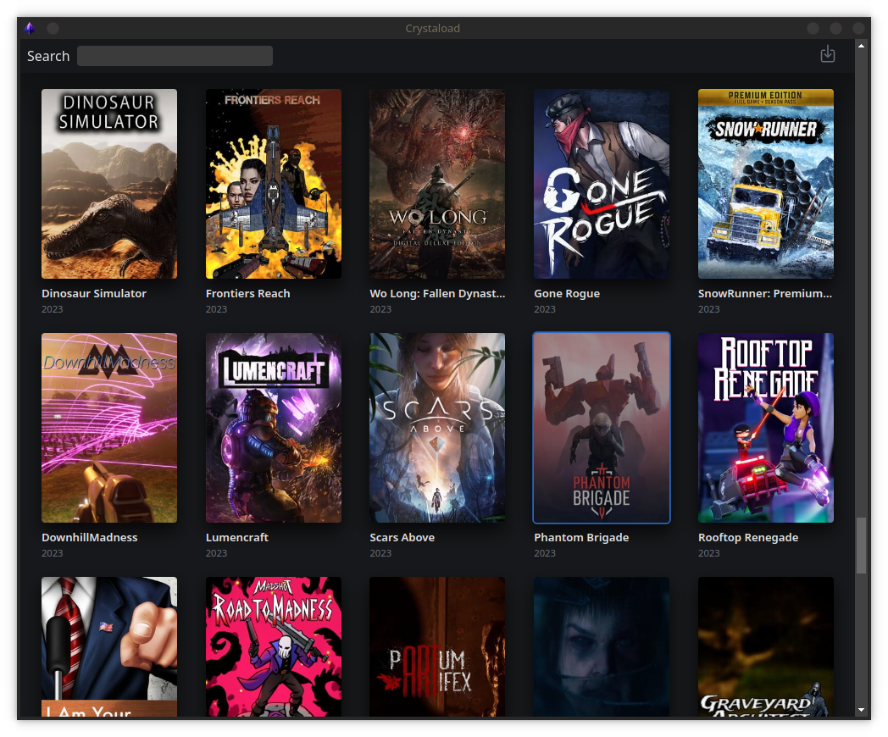
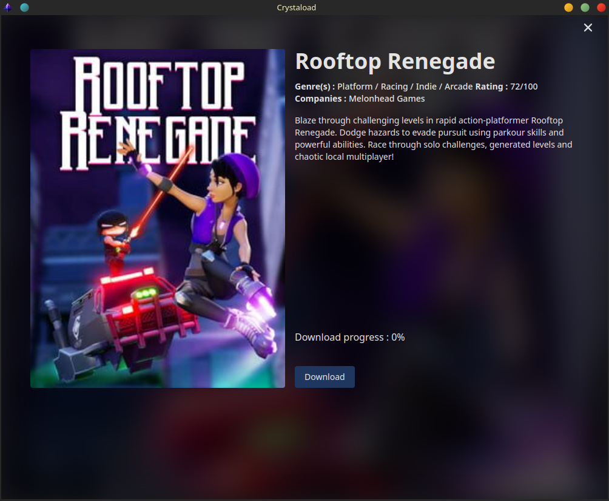

  
  

   
  

  <h1 align="center"><b>Crystaload</b></h1>
  

  Free BitTorrent client
     
    <a href="#Installation"><strong>Install »</strong></a>
     
  

# What is Crystaload ?

Crystaload is a bittorrent client that specializes in downloading games. With a clean and intuitive UI/UX.

## Features

- Browse and search games.
- View detailed game descriptions and specifications before downloading.
- Download multiple games simultaneously.
- Pause and resume downloads anytime.
- Automatically retrieve magnet links.
- View download progress and status.
- Save downloaded games to a preferred location.
- Launch your installed games within the client.

## Screenshots

## Installation

- In progress

## Roadmap

- In progress

## Contributing

Contributions are welcome from anyone! If you want to improve Crystaload, please feel free to fork this repository, make your changes, and submit a pull request.

## License

This project is licensed under the [MIT License](https://choosealicense.com/licenses/mit/)
